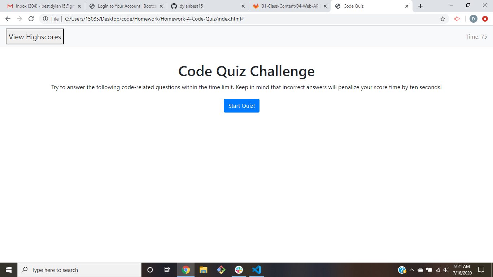

# Code-Quiz
This website is a quiz that has 5 multiple choice questions about coding. The user has 75 seconds to finish the quiz and every wrong answer will deduct 10 seconds from the timer. After every question the user will be notified if they are correct. The user's score is how many seconds they have left when they finish. Then, the user can save their name and score which will be saved to the local storage. The user can clear the high scores or press go back to take the quiz again. Lastly, the user can view the highscores at any point by clicking the view high scores button.

## Built With
- <a href="https://getbootstrap.com/">Bootstrap</a>
- <a href="https://jquery.com/">Jquery</a>

## Screenshot

## Live Link
https://dylanbest15.github.io/Code-Quiz/

## License
Copyright ©2020 Dylan Best

Permission is hereby granted, free of charge, to any person obtaining a copy of this software and associated documentation files (the "Software"), to deal in the Software without restriction, including without limitation the rights to use, copy, modify, merge, publish, distribute, sublicense, and/or sell copies of the Software, and to permit persons to whom the Software is furnished to do so, subject to the following conditions:

The above copyright notice and this permission notice shall be included in all copies or substantial portions of the Software.

THE SOFTWARE IS PROVIDED "AS IS", WITHOUT WARRANTY OF ANY KIND, EXPRESS OR IMPLIED, INCLUDING BUT NOT LIMITED TO THE WARRANTIES OF MERCHANTABILITY, FITNESS FOR A PARTICULAR PURPOSE AND NONINFRINGEMENT. IN NO EVENT SHALL THE AUTHORS OR COPYRIGHT HOLDERS BE LIABLE FOR ANY CLAIM, DAMAGES OR OTHER LIABILITY, WHETHER IN AN ACTION OF CONTRACT, TORT OR OTHERWISE, ARISING FROM, OUT OF OR IN CONNECTION WITH THE SOFTWARE OR THE USE OR OTHER DEALINGS IN THE SOFTWARE.

## Authors
- **Dylan Best** - [dylanbest15](https://github.com/dylanbest15)